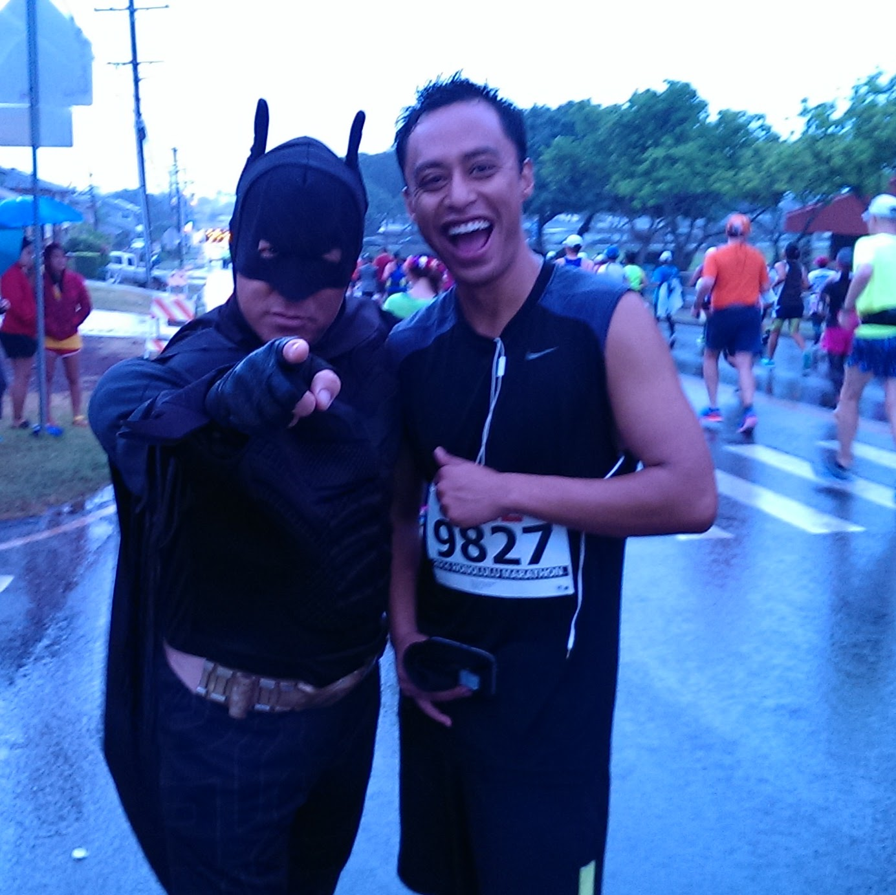

December of 2013 I decided to run a marathon. My coworkers had been trying to convince me to join for a few weeks since they had an extra ticket. I finally gave in on a Friday before the Sunday race. It was Puu Hana and I had few drinks before I took the ticket. I had 2 conditions, there would be more walking and less running and second condition was they could not abandon me and run off on their own.

On Saturday I looked at the map of the race, starts in Ala Moana and ends in Kapiolani, goes to downtown and few other places. You might have guessed I am bad with details and have suffered many times for it. I convinced myself if 30,000 people signed up for the race, it cannot be too bad. Saturday evening I went  for a walk around Ala Moana beach park for training.
Sunday morning my co workers almost broke my apartment door to wake me up at 430am. We had to run a mile just to make it to the start of the race at 5am and I was already tired. 5 mile marker felt it like a great accomplishment and i bought a pack of cigarette. Every 5 mile I would reward myself with a cigarette, that was my motivation.

A little about myself, I was not a runner  nor an athlete by any stretch of imagination. Moreover I used to drink and smoke a lot and love greasy food.

It took me 9 hours to walk that marathon and that was the most painful experience of my life. I could not walk proper for more than a month. Since then I have cut down on my drinking and smoking and started including  healthy food to my diet. I have participated in two more marathon since.

Running two marathon and walking one motivates me to keep going. I know I can achieve anything if I work hard on it. With that motivation I am back in school after taking break for few years. That is what keeps me motivated while I spend hours and days learning algorithms and python and javascript and java. Sometimes I feel like I lack something because I don't have formal education when it comes to programming. I read books and watched youtube videos and worked on projects to learn what I know. I did not have syllabus so I probably have gaps when compared to most CS students. However, I know I catch up if I work hard on it.

