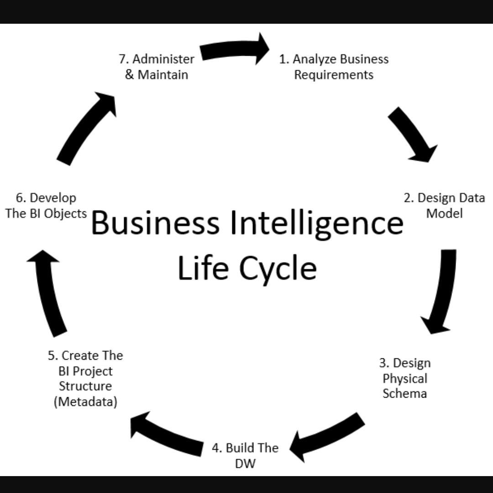

There is high demand for reports for reimbursement from insurance and funding from department of health. Each of these organizations require reports of ongoing patient care and specific data points of current state of patient assessment. Before I implemented the data warehouse, same data was being entered multiple times. While medical application was the primary destination of data entry, same data was being re-entered in access, excel etc. for various organizations. The workflow was vastly simplified by moving all the relevant data into a data warehouse, manipulating it as necessary, encrypting it and delivering the report.

Each organization had different set of requirements when it came to formatting of data. Some wanted it delimited and updated to their website, others wanted the report to be password protected and emailed, and there were others who wanted the data to be converted to predetermined encryption similar to substitution cipher. The challenge of the project was understanding the needs of those organizations and how those data are stored in our organization. While the requirements do change from time to time, the process and be streamlined. Every night relevant data is put through ETL process and loaded to data warehouse. The data is then manipulated and encrypted as necessary and moved to vendor specific data mart. Some reports are automated to run monthly while other require manual pull with different set of parameters.

