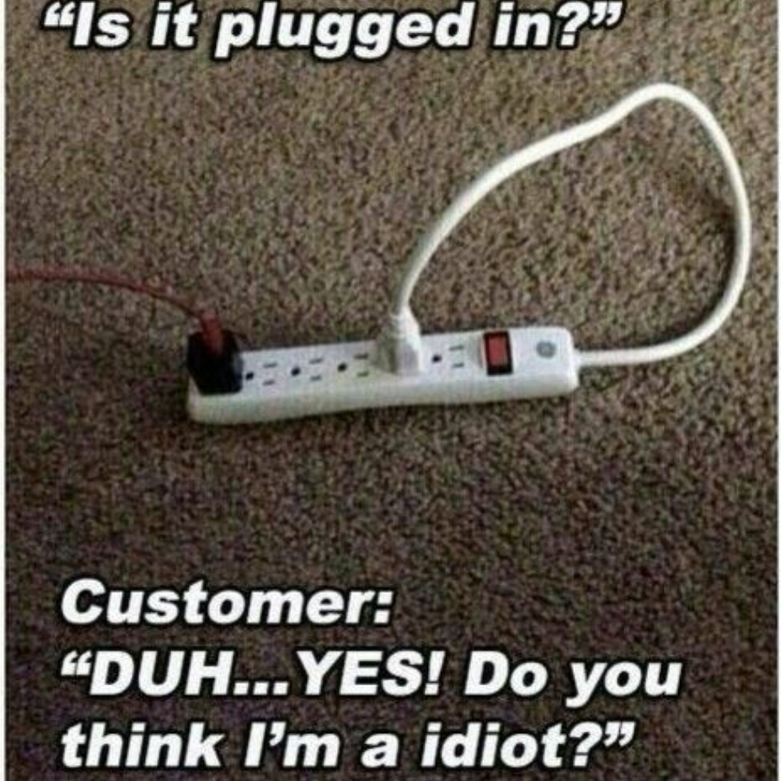

  

As always in medical field, there is a big oversight with government standards, medical community standards, insurance standards and organizational standards. Big part of my job is to develop forms for doctors and nurses that meet all those standards as well as the current workflow. Each departments  gather different set of data, each user has different UI preference and many of them are technologically challenged. Simplifying the forms for all around usability is one of the biggest challenge.

I have build forms for many specialists including optometrist, psychiatrics, pediatrician, case managers and many more for the past 3 year using MEL, CCC, VFE and occasionally SQL. MEL and CCC are application specific language and VFE is a tool to design UI for the application. They are fairly easy to use but very limited in practice. For forms that require more data or intense calculations, I pull straight from SQL database. Using tools and writing codes are pretty straightforward but communicating requirements and workflow before starting the project is still the biggest challenge.

Communication is a challenge for two main reason. Firstly, I am not as familiar with medical lingo and clinical folks say they don't talk computer. I feel the bigger issue is people are scared of change. They want to keep their years of tried and tested workflow. Introduction of a computer application to replace paper chart was probably a big shock. The default forms that came with the application changed the workflow upside down. To assist the users, I created forms in the application that looked exactly like their paper forms but it was never going to work and had to redo everything. Today before taking on any project that involve developing forms, we always go through the process of reimagining the existing workflow.

First weeks of change is difficult but most end up happy with the change. But there are others who don't like clicking mouse or typing on keyboard and voice-text is not as good with medical terms.

