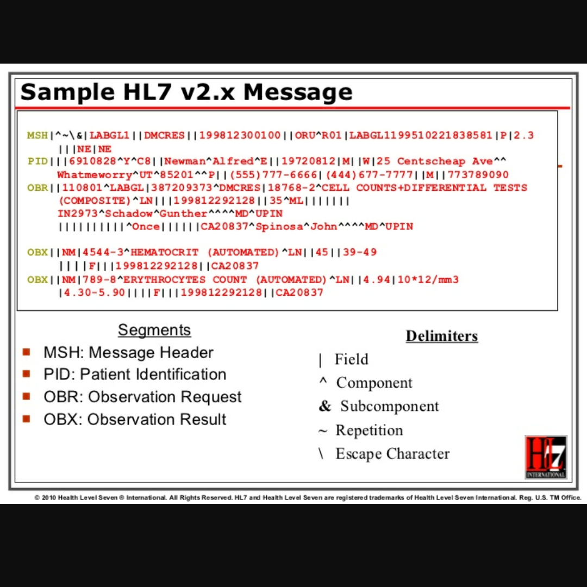

I worked on a project to setup interface with Diagnostic Laboratory Services (DLS) in 2014. While the lab ordering still requires physical delivery/ pickup of specimen, the result of those labs are now being imported electronically. When the lab results are ready, DLS drops the HL7 file to a shared folder through VPN. A python script verifies the content of the file, rearranges as necessary and moves it to a location where the application picks it up. On the application side, we used HL7 mapping to import those files and place it in the patient chart with notification to ordering provider's desktop. Each individual result is also mapped and presented in a tabular structure which helps physicians monitor the trend over time. I worked on similar project with Hawaii Pathology Lab (HPL) in 2016 where we received electronic copy of a pathology report instead of fax reports.

Similarly, in 2015, I worked with Hawaii Diagnostic Radiology Services (HDRS) to set up two interface. Unlike DLS and HPL, there is no need to send specimen for radiology services. Provider orders the x-ray, CT, MRI etc. which is routed to HDRS through VPN and we get back the result through the same channel once the radiologist recommends their findings.

All three interface project required extensive knowledge of HL7 and basic python. Since I had never heard of HL7 before working on these projects, I had to read documentation of the HL7 standard, understand basics labs and imaging and finally have a deep understanding of how the application can be manipulated to work with lab ordering and labs reports. These projects were interesting experience, meeting the requirements of many different stakeholders. The stakeholders include meeting standards set by Federal government, State of Hawaii, insurance companies, the lab company, organizational requirement and the clinical staff. It was also a great experience to collaborate with all the different stakeholders from different background and experience.

