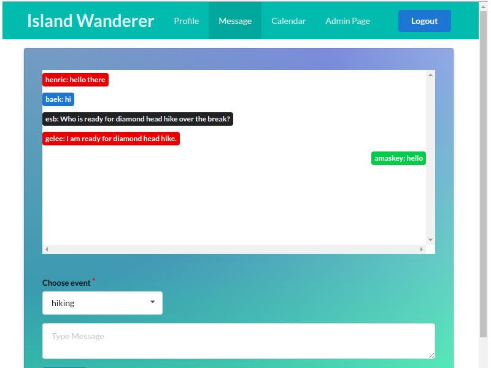
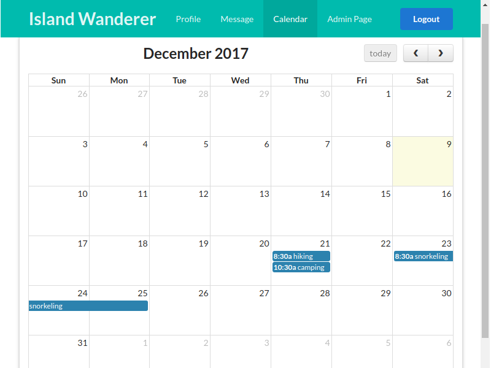

We were not able to meet our goals for the app and it counts as an incomplete project. I probably learned more lessons from this failure that I would if the app had gone as plan. The biggest lesson away from this project is the need for proper planning, especially when working in team. As I look back at the reasons we failed complete the project, it always circles back to poor planning. At its core, the app allowed students to create and subscribe to an event. Events was the heart of the app and everything else was auxiliary. As a group we did not prioritize the events and focussed on the auxiliary. To test those auxiliary features each of us created a version of event, which was slightly different from the other but different enough to create bigger issues. This poor planning could be attributed to lack of leadership or inability to see the bigger picture.

If I was working on this project again, I would definitely start off by defining all the necessary collection. There maybe small changes to the schema in the future but that puts the whole team on the same page. I work with data and I believe database is the most important part of an application. For the software engineering class, I left my belief aside and focussed on UI and functionality rather than data. I maybe overcorrecting, back to my belief, after an unsuccessful attempt to converge all the slightly different versions collections in the 11th hour.

Even though we were not able to complete our project as we imagined it, I feel that a finished product would be a useful tool for students in UH. The codes for the project is available on [github](https://github.com/islandwanderer/islandwanderer) and it can be used as a platform to build something useful.

The vision for this app was to allow UH students to plan and organize events. As campus with many out of island students, it encourages students to socialize, share ride and explore the beautiful island. The landing page is clean and simple and allows students to login to the website using their UH login. Every login takes user to their profile page. Profile page is similar to bowfolio but with a focus on various means of communication available today. The main page for the app is events where students can create new events or join an existing event. Event could be a short hike or an overnight camp. As a default all the future events are displayed on this page. Students can filter the events based on their interest. When they find an event that suit their interest, companion and time, they can join the event. 

Communication is very important when organizing events with many participants. We have a built in messaging app that allows student subscribed to an event to communicate with each other. There are different color codes of each user which is dependent on hash of their username. It has 7 possible colors because 7 feels large enough prime for the number of students who may participate in any given event. This number can be easier increased in case of increased popularity of the app. Moreover, better hash can be used to avoid collisions.

There is also a built in calendar that keeps track of all the events, user is subscribed to. Ability to create events from the calendar would have been a useful functionality but we did not get that far. Finally, moderation of communication is necessary an open forum. Students can flag comments and administrator can remove those comments if deemed inappropriate.
